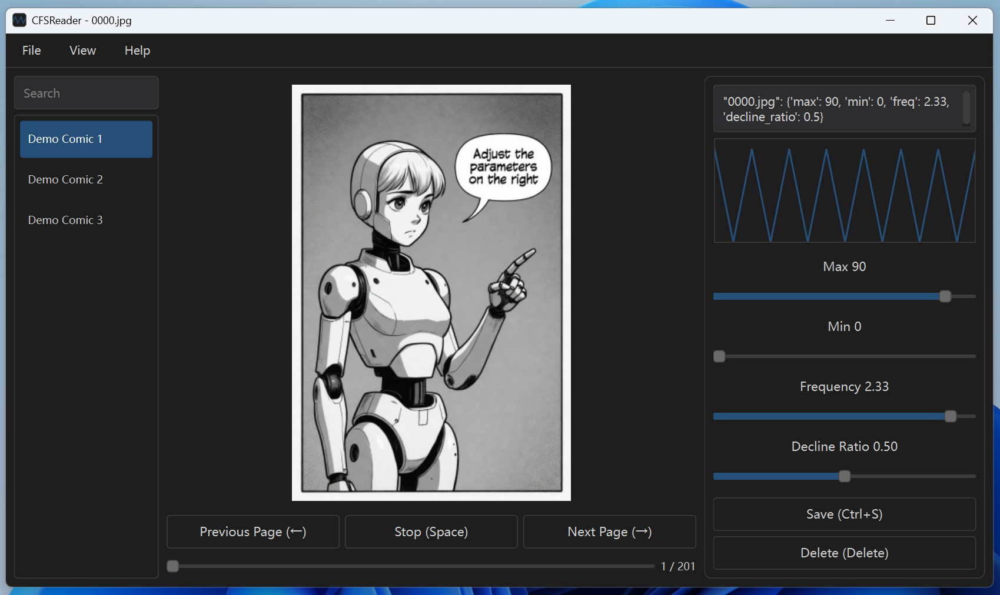

# CFSReader


CFSReader (Comic Funscript Reader) is a reader that brings comics to life.
It stores motion parameters for each comic page in a `.cfs` file and drives an OSR device through a USB serial connection.



## CFS File Format

A `.cfs` file is essentially a JSON file and must have the same name as its corresponding comic folder.

```json
{
  "1.jpg": {
    "max": 100,
    "min": 50,
    "freq": 1.5,
    "decline_ratio": 0.4
  },
  "2.jpg": {
    "max": 70,
    "min": 0,
    "freq": 2.3,
    "decline_ratio": 0.5
  }
}
```

Parameter descriptions:

* max: Highest position.
* min: Lowest position.
* freq: Frequency (number of back-and-forth movements per second).
* decline_ratio: Proportion of the downward phase within one cycle (the time spent moving from the highest position to the lowest position).

## Installation

### Method 1: Install using the package

Download the latest installer from the [Releases page](https://github.com/Karasukaigan/CFSReader/releases) and install it locally.

### Method 2: Deploy from source

```bash
git clone https://github.com/Karasukaigan/CFSReader.git
cd CFSReader

python -m venv venv
.\venv\Scripts\activate
pip install -r requirements.txt

python main.py
```

## Usage

0. Connect the OSR device to your computer via USB.
1. Place the folder containing comic images into the `comics` directory.
   (If you cannot find the `comics` directory, open it via `File` → `Open Comics Directory`.)
   Alternatively, open `Preferences` from the `File` menu, click `Select Directory` to choose a custom folder, and click `Save` to apply.
2. Open `Preferences` from the `File` menu, select the correct serial port under `Serial Port Device`, and click `Save`.
3. Click a comic on the left side of the main window to load it on the right.
4. Press `F10` to open the CFS Editor, which will appear on the far right side of the window.
5. Click `Export CFS File` in the `File` menu to export the current comic’s `.cfs` file, allowing you to share it with others.
6. `.cfs` files should be placed in the `cfs` directory. You can open the `cfs` directory by clicking `Open CFS Directory` in the `File` menu. However, following the Funscript convention, `.cfs` files can also be placed in the `comics` directory or inside the comic’s folder (alongside the images).

## Contributing

[Issues](https://github.com/Karasukaigan/CFSReader/issues) and [Pull Requests](https://github.com/Karasukaigan/CFSReader/pulls) are welcome to help improve this project.

## License

This project is licensed under the [MIT License](./LICENSE).

## Support Development

This project is free and open source, developed and maintained in my spare time by [me](https://github.com/Karasukaigan). If you find it helpful or inspiring, please consider supporting its continued development.

Your donation helps cover development time, feature improvements, and maintenance costs.

| Ethereum | Bitcoin |
|:---:|:---:|
| 0x3E709387db900c47C6726e4CFa40A5a51bC9Fb97 | bc1qguk59xapemd3k0a8hen229av3vs5aywq9gzk6e |
|  |  |

Every contribution, no matter the amount, is greatly appreciated. Thank you for supporting open-source!